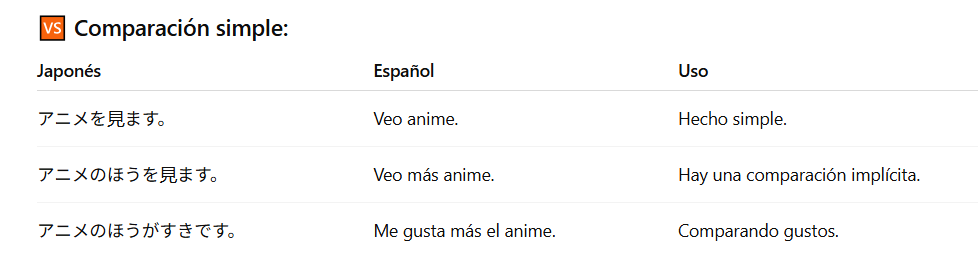

## Charlando sobre que deportes veo.

    スポ-ツをみますか。
    Ves deportes?.

    
    みます。
    Miro o si miro.
    すいえいとかサッカーみます。
    すいえい: Natación
    とか: Particula para enumerar ejemplos, es decir, dar ejemplos.
    サッカー: fútbol(del inglés, soccer).
    みます。: Mirar, ver(Forma educada).
    Resumen: Veo cosas como natación y el fútbol.
    エマニュアルさんは？
    エマニュアル: Emanuaru, Mi nombre o la manera en que me llaman en katakana. 
    さん: Sufijo honorifico, como "Sr o Sra".
    は？: Particula que marca el tema, aqui se usa para devolver la pregunta.
    Resumen: Y tu?.

    ときどきサッカーをみます。
    ときどき: A veces.
    サッカー: fútbol(del inglés, soccer).
    を: Particula de objeto directo que recibe al accion del verbo qeu sigue.
    みます。: Mirar, ver(Forma educada).
    Resumen: A veces veo fútbol.
    アニメのほうをよくみます。
    アニメ: Anime
    のほう: Literalmente "el lado de" o "la opcion de", usado aqui para comprar o dar enfasis/preferencia ->"mas anime", aqui se esta comparando con otras cosas, como fútbol u otras actividades.
    
    を: Particula de objeto directo que recibe al accion del verbo que sigue.
    よく: A menudo, con frecuencia.
    みます。: Mirar, ver(Forma educada).
    Resumen: Veo más anime o Veo anime más seguido.

